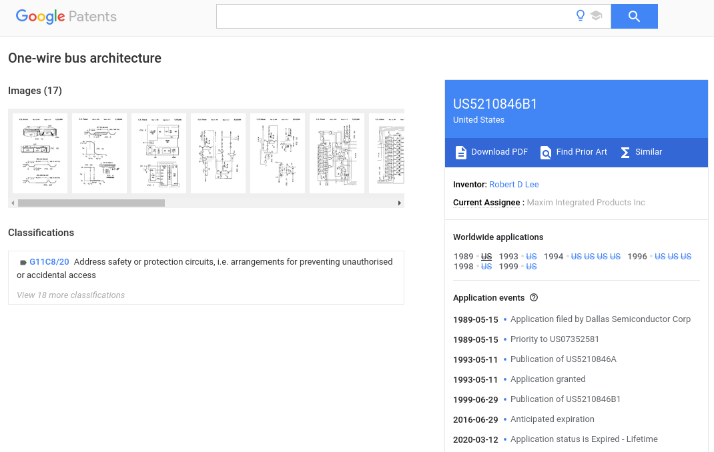

# STM8S examples

During XMas holidays 2019 I was working on a micro-controller project based on STM8S103F3P6. I am developing on Linux using the SDCC compiler. 

The reference manual for the STM8S and other platform related documentation is good but sometimes it can be challenging to find good and useful example or tutorial for a certain aspect.

In order to continue my project I needed to work through some of the examples based on the reference manual and what information I could find on the internet. I like to share these samples so hopefully some of you might find these useful.

* [blink led using timer without interrupt](/tim2_no_irq)
* [blink LED using timer and interrupt](/tim2_pulse)
* [blink using timer based delay function](/time4_delay)
* [use a button to create an external interrupt](/button_ext_interrupt)
* [UART](/uart)

# STM8S getting started

For getting started on STM8S using the SDCC compiler I recommend the following two excellent articles:

* [Bare metal programming: STM8](https://lujji.github.io/blog/bare-metal-programming-stm8/)
* [Bare metal programming: STM8 (Part 2)](https://lujji.github.io/blog/bare-metal-programming-stm8-part2/)

The lib_stm8s and the Makefile I use for my samples are based on lujjis work. So all documentation should be valid and helpful.

# License

My current understanding is that the patent for the 1-wire bus architecture is expired and therefore can be used:

However I am not a patent lawyer... Consequently I am sharing this for educational purposes only.
